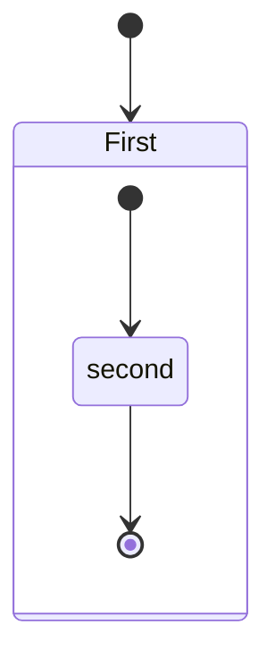

Markdown PDF
This extension converts Markdown files to pdf, html, png or jpeg files.

Japanese README

Table of Contents
Breaking Changes in 2.0.0
Features
Chromium
Extension Settings
Options
FAQ
Known Issues
Release Notes
License
Special thanks
Breaking Changes in 2.0.0
Version 2.0.0 introduces changes that may affect existing behavior. See the FAQ section for details.

Heading IDs now follow GitHub-compatible VS Code slug generation. Existing internal anchors in your documents may change. See Why did my heading anchors change?.
Highlight.js upgraded from v9 to v11. Some highlight style names have been renamed or removed. See Why did my syntax highlight style stop working?.
Front matter parsing is now stricter. Some previously accepted formats may be rejected. See Why is my front matter no longer parsed?.
Chromium is resolved from an installed Chrome/Edge browser first, or auto-downloaded on first use. See How is the Chromium browser selected? and Where is Chromium downloaded?.
Features
Feature	Description	Example
Syntax highlighting	Code block highlighting via highlight.js	```js
Emoji	Emoji shortcodes	:smile:
Checkbox	GitHub-style task lists	- [ ] / - [x]
Heading IDs	GitHub-compatible heading anchors	# Heading → #heading
Container	Admonition-like blocks	::: warning
Include	Embed Markdown fragments	:[label](https://github.com/yzane/vscode-markdown-pdf/blob/HEAD/path.md)
PlantUML	UML diagrams from code blocks	@startuml … @enduml
Mermaid	Diagrams from fenced code blocks	```mermaid
Sample files

pdf
html
png
jpeg
Heading IDs
Headings automatically receive GitHub-compatible anchor IDs. For example:

Heading	Generated ID
# My Heading	#my-heading
# API Reference	#api-reference
# 日本語見出し	#日本語見出し
See Why did my heading anchors change? in the FAQ for details.

Checkbox
INPUT

- [ ] Task A
- [x] Task B

OUTPUT

<ul>
  <li><input type="checkbox" disabled> Task A</li>
  <li><input type="checkbox" disabled checked> Task B</li>
</ul>

Container
Admonition-like blocks via markdown-it-container.

INPUT

::: warning
*here be dragons*
:::

OUTPUT

<div class="warning">
<p><em>here be dragons</em></p>
</div>

PlantUML
Render UML diagrams via PlantUML using markdown-it-plantuml.

INPUT

@startuml
Bob -[#red]> Alice : hello
Alice -[#0000FF]->Bob : ok
@enduml

OUTPUT

PlantUML

Include
Include markdown fragment files: :[alternate-text](https://github.com/yzane/vscode-markdown-pdf/blob/HEAD/relative-path-to-file.md).

├── [plugins]
│  └── README.md
├── CHANGELOG.md
└── README.md

INPUT

README Content

:[Plugins](https://github.com/yzane/vscode-markdown-pdf/blob/HEAD/plugins/README.md)

:[Changelog](https://github.com/yzane/vscode-markdown-pdf/blob/HEAD/CHANGELOG.md)

OUTPUT

Content of README.md

Content of plugins/README.md

Content of CHANGELOG.md

Mermaid
Render diagrams from fenced code blocks via Mermaid.

INPUT


OUTPUT

mermaid

Chromium
Markdown PDF uses a Chromium-based browser for PDF/PNG/JPEG export. It tries the following sources in order:

The path specified in markdown-pdf.executablePath
An installed Google Chrome, Microsoft Edge, or Chromium on your system
A managed Chromium automatically downloaded on first use
See How is the Chromium browser selected? and Where is Chromium downloaded? in the FAQ for details.

If you are behind a proxy, set the http.proxy option in settings.json and restart Visual Studio Code.

Usage
Command Palette
Open the Markdown file
Press F1 or Ctrl+Shift+P
Type export and select below
markdown-pdf: Export (settings.json)
markdown-pdf: Export (pdf)
markdown-pdf: Export (html)
markdown-pdf: Export (png)
markdown-pdf: Export (jpeg)
markdown-pdf: Export (all: pdf, html, png, jpeg)
usage1

Menu
Open the Markdown file
Right click and select below
markdown-pdf: Export (settings.json)
markdown-pdf: Export (pdf)
markdown-pdf: Export (html)
markdown-pdf: Export (png)
markdown-pdf: Export (jpeg)
markdown-pdf: Export (all: pdf, html, png, jpeg)
usage2

Auto convert
Add "markdown-pdf.convertOnSave": true option to settings.json
Restart Visual Studio Code
Open the Markdown file
Auto convert on save
Extension Settings
Visual Studio Code User and Workspace Settings

Select File > Preferences > UserSettings or Workspace Settings
Find markdown-pdf settings in the Default Settings
Copy markdown-pdf.* settings
Paste to the settings.json, and change the value
demo

Options
List
Category	Option name	Configuration scope
Save options	markdown-pdf.type	
markdown-pdf.convertOnSave	
markdown-pdf.convertOnSaveExclude	
markdown-pdf.outputDirectory	
markdown-pdf.outputDirectoryRelativePathFile	
Styles options	markdown-pdf.styles	
markdown-pdf.stylesRelativePathFile	
markdown-pdf.includeDefaultStyles	
Syntax highlight options	markdown-pdf.highlight	
markdown-pdf.highlightStyle	
Markdown options	markdown-pdf.breaks	
Emoji options	markdown-pdf.emoji	
Configuration options	markdown-pdf.executablePath	
Common Options	markdown-pdf.scale	
PDF options	markdown-pdf.displayHeaderFooter	resource
markdown-pdf.headerTemplate	resource
markdown-pdf.footerTemplate	resource
markdown-pdf.printBackground	resource
markdown-pdf.orientation	resource
markdown-pdf.pageRanges	resource
markdown-pdf.format	resource
markdown-pdf.width	resource
markdown-pdf.height	resource
markdown-pdf.margin.top	resource
markdown-pdf.margin.bottom	resource
markdown-pdf.margin.right	resource
markdown-pdf.margin.left	resource
PNG JPEG options	markdown-pdf.quality	
markdown-pdf.clip.x	
markdown-pdf.clip.y	
markdown-pdf.clip.width	
markdown-pdf.clip.height	
markdown-pdf.omitBackground	
PlantUML options	markdown-pdf.plantumlOpenMarker	
markdown-pdf.plantumlCloseMarker	
markdown-pdf.plantumlServer	
markdown-it-include options	markdown-pdf.markdown-it-include.enable	
mermaid options	markdown-pdf.mermaidServer	
Save options
markdown-pdf.type
Output format: pdf, html, png, jpeg
Multiple output formats support
Default: pdf
"markdown-pdf.type": [
  "pdf",
  "html",
  "png",
  "jpeg"
],

markdown-pdf.convertOnSave
Enable Auto convert on save
boolean. Default: false
To apply the settings, you need to restart Visual Studio Code
markdown-pdf.convertOnSaveExclude
Excluded file name of convertOnSave option
"markdown-pdf.convertOnSaveExclude": [
  "^work",
  "work.md$",
  "work|test",
  "[0-9][0-9][0-9][0-9]-work",
  "work\\test"  // All '\' need to be written as '\\' (Windows)
],

markdown-pdf.outputDirectory
Output Directory
All \ need to be written as \\ (Windows)
"markdown-pdf.outputDirectory": "C:\\work\\output",

Relative path
If you open the Markdown file, it will be interpreted as a relative path from the file
If you open a folder, it will be interpreted as a relative path from the root folder
If you open the workspace, it will be interpreted as a relative path from each root folder
See Multi-root Workspaces
"markdown-pdf.outputDirectory": "output",

Relative path (home directory)
If path starts with ~, it will be interpreted as a relative path from the home directory
"markdown-pdf.outputDirectory": "~/output",

If you set a directory with a relative path, it will be created if the directory does not exist
If you set a directory with an absolute path, an error occurs if the directory does not exist
markdown-pdf.outputDirectoryRelativePathFile
If markdown-pdf.outputDirectoryRelativePathFile option is set to true, the relative path set with markdown-pdf.outputDirectory is interpreted as relative from the file
It can be used to avoid relative paths from folders and workspaces
boolean. Default: false
Styles options
markdown-pdf.styles
A list of local paths to the stylesheets to use from the markdown-pdf
If the file does not exist, it will be skipped
All \ need to be written as \\ (Windows)
"markdown-pdf.styles": [
  "C:\\Users\\<USERNAME>\\Documents\\markdown-pdf.css",
  "/home/<USERNAME>/settings/markdown-pdf.css",
],

Relative path
If you open the Markdown file, it will be interpreted as a relative path from the file
If you open a folder, it will be interpreted as a relative path from the root folder
If you open the workspace, it will be interpreted as a relative path from each root folder
See Multi-root Workspaces
"markdown-pdf.styles": [
  "markdown-pdf.css",
],

Relative path (home directory)
If path starts with ~, it will be interpreted as a relative path from the home directory
"markdown-pdf.styles": [
  "~/.config/Code/User/markdown-pdf.css"
],

Online CSS (https://xxx/xxx.css) is applied correctly for JPG and PNG, but problems occur with PDF #67
"markdown-pdf.styles": [
  "https://xxx/markdown-pdf.css"
],

markdown-pdf.stylesRelativePathFile
If markdown-pdf.stylesRelativePathFile option is set to true, the relative path set with markdown-pdf.styles is interpreted as relative from the file
It can be used to avoid relative paths from folders and workspaces
boolean. Default: false
markdown-pdf.includeDefaultStyles
Enable the inclusion of default Markdown styles (VSCode, markdown-pdf)
boolean. Default: true
Syntax highlight options
markdown-pdf.highlight
Enable Syntax highlighting
boolean. Default: true
markdown-pdf.highlightStyle
Set the current highlight.js style file name. Examples: github.css, monokai.css, base16/solarized-dark.css
file name list
demo site : https://highlightjs.org/demo
"markdown-pdf.highlightStyle": "github.css",

Markdown options
markdown-pdf.breaks
Enable line breaks
boolean. Default: false
Emoji options
markdown-pdf.emoji
Enable emoji. EMOJI CHEAT SHEET
boolean. Default: true
Configuration options
markdown-pdf.executablePath
Path to a Google Chrome, Microsoft Edge, or Chromium executable to run instead of the bundled Chromium
See How is the Chromium browser selected? in the FAQ for how this setting interacts with installed browser detection and the managed Chromium download
All \ need to be written as \\ (Windows)
To apply the settings, you need to restart Visual Studio Code
"markdown-pdf.executablePath": "C:\\Program Files (x86)\\Google\\Chrome\\Application\\chrome.exe"

Common Options
markdown-pdf.scale
Scale of the page rendering
number. Default: 1
"markdown-pdf.scale": 1

PDF options
pdf only. puppeteer page.pdf options
markdown-pdf.displayHeaderFooter
Enables header and footer display
boolean. Default: true
Activating this option will display both the header and footer
If you wish to display only one of them, remove the value for the other
To hide the header
"markdown-pdf.headerTemplate": "",

To hide the footer
"markdown-pdf.footerTemplate": "",

markdown-pdf.headerTemplate
Specifies the HTML template for outputting the header
To use this option, you must set markdown-pdf.displayHeaderFooter to true
<span class='date'></span> : formatted print date. The format depends on the environment
<span class='title'></span> : markdown file name
<span class='url'></span> : markdown full path name
<span class='pageNumber'></span> : current page number
<span class='totalPages'></span> : total pages in the document
%%ISO-DATETIME%% : current date and time in ISO-based format (YYYY-MM-DD hh:mm:ss)
%%ISO-DATE%% : current date in ISO-based format (YYYY-MM-DD)
%%ISO-TIME%% : current time in ISO-based format (hh:mm:ss)
Default (version 1.5.0 and later): Displays the Markdown file name and the date using %%ISO-DATE%%
"markdown-pdf.headerTemplate": "<div style=\"font-size: 9px; margin-left: 1cm;\"> <span class='title'></span></div> <div style=\"font-size: 9px; margin-left: auto; margin-right: 1cm; \">%%ISO-DATE%%</div>",

Default (version 1.4.4 and earlier): Displays the Markdown file name and the date using <span class='date'></span>
"markdown-pdf.headerTemplate": "<div style=\"font-size: 9px; margin-left: 1cm;\"> <span class='title'></span></div> <div style=\"font-size: 9px; margin-left: auto; margin-right: 1cm; \"> <span class='date'></span></div>",

markdown-pdf.footerTemplate
Specifies the HTML template for outputting the footer
For more details, refer to markdown-pdf.headerTemplate
Default: Displays the {current page number} / {total pages in the document}
"markdown-pdf.footerTemplate": "<div style=\"font-size: 9px; margin: 0 auto;\"> <span class='pageNumber'></span> / <span class='totalPages'></span></div>",

markdown-pdf.printBackground
Print background graphics
boolean. Default: true
markdown-pdf.orientation
Paper orientation
portrait or landscape
Default: portrait
markdown-pdf.pageRanges
Paper ranges to print, e.g., '1-5, 8, 11-13'
Default: all pages
"markdown-pdf.pageRanges": "1,4-",

markdown-pdf.format
Paper format
Letter, Legal, Tabloid, Ledger, A0, A1, A2, A3, A4, A5, A6
Default: A4
"markdown-pdf.format": "A4",

markdown-pdf.width
markdown-pdf.height
Paper width / height, accepts values labeled with units(mm, cm, in, px)
If it is set, it overrides the markdown-pdf.format option
"markdown-pdf.width": "10cm",
"markdown-pdf.height": "20cm",

markdown-pdf.margin.top
markdown-pdf.margin.bottom
markdown-pdf.margin.right
markdown-pdf.margin.left
Paper margins.units(mm, cm, in, px)
"markdown-pdf.margin.top": "1.5cm",
"markdown-pdf.margin.bottom": "1cm",
"markdown-pdf.margin.right": "1cm",
"markdown-pdf.margin.left": "1cm",

PNG, JPEG options
png and jpeg only. puppeteer page.screenshot options
markdown-pdf.quality
jpeg only. The quality of the image, between 0-100. Not applicable to png images
"markdown-pdf.quality": 100,

markdown-pdf.clip.x
markdown-pdf.clip.y
markdown-pdf.clip.width
markdown-pdf.clip.height
An object which specifies clipping region of the page
number
//  x-coordinate of top-left corner of clip area
"markdown-pdf.clip.x": 0,

// y-coordinate of top-left corner of clip area
"markdown-pdf.clip.y": 0,

// width of clipping area
"markdown-pdf.clip.width": 1000,

// height of clipping area
"markdown-pdf.clip.height": 1000,

markdown-pdf.omitBackground
Hides default white background and allows capturing screenshots with transparency
boolean. Default: false
PlantUML options
markdown-pdf.plantumlOpenMarker
Opening delimiter used for the plantuml parser.
Default: @startuml
markdown-pdf.plantumlCloseMarker
Closing delimiter used for the plantuml parser.
Default: @enduml
markdown-pdf.plantumlServer
Plantuml server. e.g. http://localhost:8080
Default: http://www.plantuml.com/plantuml
For example, to run Plantuml Server locally #139 :
docker run -d -p 8080:8080 plantuml/plantuml-server:jetty

plantuml/plantuml-server - Docker Hub
markdown-it-include options
markdown-pdf.markdown-it-include.enable
Enable markdown-it-include.
boolean. Default: true
mermaid options
markdown-pdf.mermaidServer
mermaid server
Default: https://unpkg.com/mermaid/dist/mermaid.min.js
FAQ
How can I change emoji size ?
Add the following to your stylesheet which was specified in the markdown-pdf.styles
.emoji {
  height: 2em;
}

Auto guess encoding of files
Using files.autoGuessEncoding option of the Visual Studio Code is useful because it automatically guesses the character code. See files.autoGuessEncoding

"files.autoGuessEncoding": true,

Output directory
If you always want to output to the relative path directory from the Markdown file.

For example, to output to the "output" directory in the same directory as the Markdown file, set it as follows.

"markdown-pdf.outputDirectory" : "output",
"markdown-pdf.outputDirectoryRelativePathFile": true,

Page Break
Please use either of the following to insert a page break.

<div class="page"/>

<div class="page"></div>

Why did my heading anchors change?
Starting with 2.0.0, Markdown PDF generates heading IDs using a custom markdown-it-named-headers implementation that follows GitHub-compatible VS Code slug generation. Compared to the previous implementation, the new slug generator preserves CJK characters and underscores while removing unsupported punctuation, which can cause existing internal anchors (e.g. #some-heading) to resolve differently.

If your Markdown relies on specific anchor strings (for example, a table of contents or cross-document links), re-check the generated anchors after exporting and update the links as needed.

Why did my syntax highlight style stop working?
Starting with 2.0.0, Markdown PDF uses highlight.js v11 (previously v9). Some style names from v9 have been renamed or removed. Markdown PDF maps legacy style names to current names where possible and shows a warning message when a configured style cannot be found. If no mapping is available, the extension falls back to tomorrow.css.

Please check the available styles and update your markdown-pdf.highlightStyle setting to a current style name.

Why is my front matter no longer parsed?
Starting with 2.0.0, Markdown PDF parses YAML front matter with a custom implementation instead of gray-matter. The new parser is stricter and rejects the following cases that the old parser may have accepted:

Top-level YAML sequences (arrays) as front matter
Front matter that does not parse into a plain object
Malformed YAML structures
A valid front matter must be a YAML mapping (object) at the top level, for example:

---
title: My Document
"markdown-pdf":
  displayHeaderFooter: true
---

BOM-prefixed files are still supported.

How is the Chromium browser selected?
Markdown PDF resolves a Chromium-based browser in the following order:

The path specified in markdown-pdf.executablePath, if the file exists.
An installed browser on your system. Google Chrome (stable) is detected via @puppeteer/browsers at its standard OS install location; Microsoft Edge and Chromium are probed at the fixed paths listed below.
A managed Chromium that Markdown PDF automatically downloads on first use.
The first match wins. The per-OS scan order for installed Edge and Chromium is:

Windows

Google Chrome (stable install, detected via @puppeteer/browsers)
%LOCALAPPDATA%\Microsoft\Edge\Application\msedge.exe
%LOCALAPPDATA%\Chromium\Application\chrome.exe
%PROGRAMFILES%\Microsoft\Edge\Application\msedge.exe
%PROGRAMFILES%\Chromium\Application\chrome.exe
%PROGRAMFILES(X86)%\Microsoft\Edge\Application\msedge.exe
%PROGRAMFILES(X86)%\Chromium\Application\chrome.exe
macOS

Google Chrome (stable install, detected via @puppeteer/browsers)
/Applications/Chromium.app/Contents/MacOS/Chromium
/Applications/Microsoft Edge.app/Contents/MacOS/Microsoft Edge
Linux

Google Chrome (stable install, detected via @puppeteer/browsers)
/usr/bin/chromium-browser
/usr/bin/chromium
/usr/bin/microsoft-edge
/usr/bin/microsoft-edge-stable
Where is Chromium downloaded?
If no installed browser is found, Markdown PDF downloads a managed Chromium on first use. The download is stored under the extension's VS Code global storage directory:

OS	Download path
Windows	%APPDATA%\Code\User\globalStorage\yzane.markdown-pdf\
macOS	~/Library/Application Support/Code/User/globalStorage/yzane.markdown-pdf/
Linux	~/.config/Code/User/globalStorage/yzane.markdown-pdf/
If you use VS Code Insiders or VSCodium, the base path changes accordingly (for example Code - Insiders or VSCodium instead of Code).

During the download, Installing Chromium is shown in the status bar.

Known Issues
markdown-pdf.styles option
Online CSS (https://xxx/xxx.css) is applied correctly for JPG and PNG, but problems occur with PDF. #67
Release Notes
2.0.1 (2026/04/14)
Fix: Self-closing <div class="page" /> now correctly triggers a page break #428
2.0.0 (2026/04/13)
Breaking: Heading ID slug generation, front matter parsing, and Chromium resolution have changed. See the FAQ for details.
Change: Migrate to TypeScript and bundle with esbuild
Change: Bundle puppeteer-core and manage Chromium via the built-in chromium-resolver (installed Chrome/Edge preferred, auto-download fallback)
Change: Replace markdown-it-include, markdown-it-named-headers, and markdown-it-checkbox with in-repo custom implementations
Change: Remove cheerio, mustache, and gray-matter dependencies
Add: Unit and integration test suites (vscode-test-cli)
For details, see Change Log.

License
MIT

Special thanks
puppeteer/puppeteer
markdown-it/markdown-it
markdown-it/markdown-it-emoji
HenrikJoreteg/emoji-images
highlightjs/highlight.js
markdown-it/markdown-it-container
gmunguia/markdown-it-plantuml
mermaid-js/mermaid
